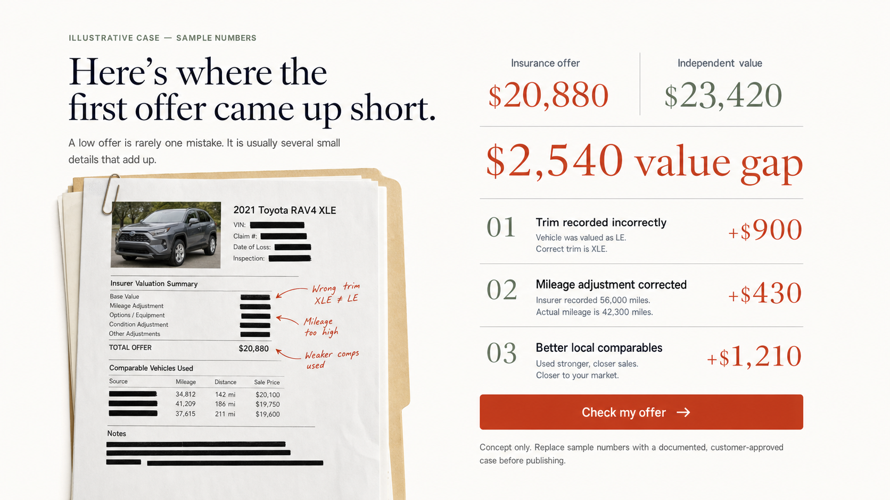
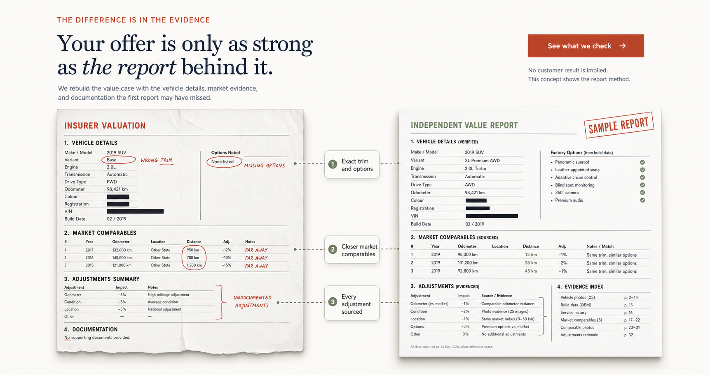
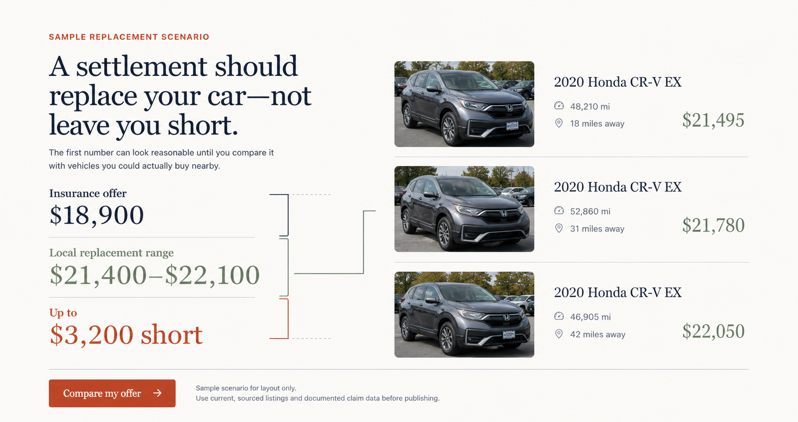

# Homepage proof-section concepts

Generated July 22, 2026 with the built-in image generation tool. These are visual direction studies, not production UI and not customer evidence.

## The strategic problem

The current section explains what Spur Auto reviews, but it does not make the buyer feel the cost of a weak valuation or show a concrete deliverable. The user is not primarily worried about “inputs.” They are worried that the insurer's settlement will not buy a genuinely comparable replacement vehicle.

Design thesis:

> This section should feel like a calm claim-file reveal for a driver questioning a low total-loss offer, because they need to see what could be wrong and what Spur Auto will produce; it must connect appraisal work to money without overstating outcomes, and differ from generic service marketing through redacted documents, sourced comparisons, and explicit claim boundaries.

Repository truth gate: no publication-ready customer case records or consented vehicle photos were found. The current homepage claim examples are flagged elsewhere in the repository as illustrative. Do not publish generated or sample figures as completed customer results.

## 01 — Case-file value gap

Job: make a real customer outcome concrete by showing the total gap and the three corrections that created it.

Best use: after one documented, customer-approved case is available.

Tradeoff: strongest emotional and conversion potential, but it cannot be published honestly with sample numbers.

Production evidence needed:

- written customer approval and a redaction plan;
- original insurer offer and final value/payment documentation;
- a reconciliation showing how each correction relates to the total;
- vehicle photo rights or a document-only fallback;
- date, location scope, and an individual-results disclaimer.

Prompt set:

> Create a high-fidelity 16:9 website section for an independent total-loss appraisal service using Spur Auto's warm white, navy, oxide, and sage editorial system. Show an explicitly labeled “ILLUSTRATIVE CASE — SAMPLE NUMBERS” with a redacted 2021 Toyota RAV4 XLE claim file, an insurance offer of $20,880, independent value of $23,420, a $2,540 value gap, and three findings that reconcile exactly to the gap: trim +$900, mileage +$430, comparables +$1,210. Use the headline “Here’s where the first offer came up short.” Include a direct “Check my offer” CTA and a prominent instruction to replace all sample numbers with a documented, customer-approved case. No real insurer logos, customer names, testimonial, gradient, glass, or generic SaaS cards.

## 02 — Report-artifact comparison

Job: prove what Spur Auto does by contrasting an insurer valuation with the independent evidence package.

Best use: publishable before a customer outcome library exists, provided the sample report is based on a real Spur Auto deliverable and remains clearly labeled.

Tradeoff: lower emotional intensity than a verified case, but the safest and most credible immediate replacement.

Production evidence needed:

- a real redacted sample report or a deliberately generic demo report;
- confirmation that the named report sections match the paid deliverable;
- source/date conventions for comparables and adjustment evidence.

Prompt set:

> Create a high-fidelity 16:9 editorial website section in Spur Auto's warm white, navy, oxide, and sage system. Headline: “Your offer is only as strong as the report behind it.” Make two large document artifacts the proof: a generic redacted “INSURER VALUATION” with annotated wrong trim, missing options, distant comparables, and undocumented adjustments; and an “INDEPENDENT VALUE REPORT” stamped “SAMPLE REPORT” with verified vehicle details, closer market comparables, sourced adjustments, and an evidence index. Connect three callouts: “Exact trim and options,” “Closer market comparables,” and “Every adjustment sourced.” Include “See what we check” and state that no customer result is implied. No settlement figures, testimonials, insurer logos, gradients, glass, or dashboard styling.

## 03 — Replacement gap

Job: translate appraisal language into the buyer's actual fear: being unable to replace the totaled vehicle with a comparable one.

Best use: as a dynamic or regularly refreshed market-evidence module using current local listings.

Tradeoff: extremely clear pain framing, but stale or selectively chosen listings would damage trust.

Production evidence needed:

- current listing URLs, capture dates, mileage, trim, and distance;
- a documented comparison method and geographic scope;
- scheduled expiry or refresh behavior for listing evidence;
- explicit separation between asking prices and final transaction values.

Prompt set:

> Create a high-fidelity 16:9 website section in Spur Auto's editorial visual system. Label it “SAMPLE REPLACEMENT SCENARIO.” Headline: “A settlement should replace your car—not leave you short.” Compare an $18,900 insurance offer with a $21,400–$22,100 local replacement range and label the difference “Up to $3,200 short.” Show three evidence-style 2020 Honda CR-V EX listing rows with mileage, distance, and prices of $21,495, $21,780, and $22,050. Include “Compare my offer” and a prominent note that current sourced listings and documented claim data are required before publishing. No dealer or insurer logos, testimonials, promises, gradients, glass, or shopping-card styling.

## Recommendation

Use a hybrid of concepts 01 and 02:

1. Lead with one verified value gap when a real case is approved.
2. Reconcile that gap into two or three documented findings.
3. Show the redacted report page that supports those findings.
4. Place “Check my offer” immediately after the evidence.
5. Until a verified case exists, ship concept 02 and describe the report method without customer-outcome numbers.

Mobile priority: show the pain headline, value gap or report contrast, and CTA before the long artifact. Put the detailed document breakdown in a swipeable image or accessible disclosure below; do not merely stack the desktop columns.
